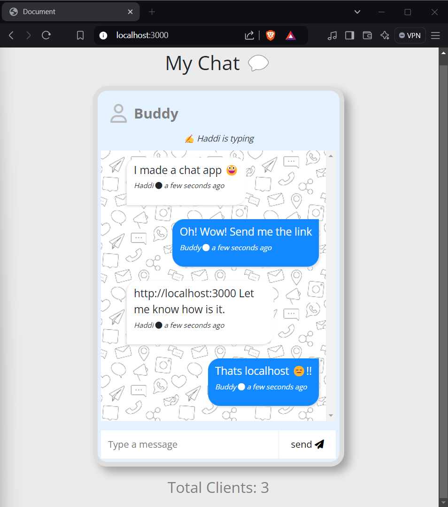

# Chat Application using WebSockets

## Introduction
This project is a simple real-time chat application that uses WebSockets to enable two-way communication between a client and server. It leverages the power of Socket.io for real-time, event-driven communication, and Express.js as the backend framework.

## About WebSockets
WebSockets provide a full-duplex communication channel over a single TCP connection. This allows servers and clients to send messages to each other at any time, enabling real-time functionality like chats, notifications, or gaming.

### Conventional Approach
Typically, in a web application, communication between the client and server is handled via HTTP, which is stateless and request-driven. The client sends a request, and the server responds, ending the connection. However, this approach is not ideal for real-time applications where continuous communication is needed.

### Disadvantages Overcome by WebSockets
With WebSockets, the client and server maintain a persistent connection, allowing bidirectional communication. This overcomes the traditional limitations of HTTP in real-time apps, like:
- **Polling**: Constantly checking for updates leads to unnecessary load and delays.
- **Latency**: WebSockets offer faster communication with lower latency, as messages are sent immediately.
- **Scalability**: Efficient communication, reducing server load in real-time systems.

## Working about Websockets


## Installation

Install my-project with npm

```bash
  git clone https://github.com/vishwajeetk5/Mychat.git
  cd Mychat
  npm Install
  npm start
```
The server will be live on http://localhost:3000.
## Output


## Usage
Open multiple browser tabs or connect from different devices to see real-time chat updates.
The client can send messages, and each message will be broadcasted to all other connected clients.

## Application Features
- Real-time Messaging: Instant message delivery between clients.
- Typing Indicators: See when another user is typing.
- Client Counter: Shows the number of connected clients.
- Sound Notifications: A sound plays when a new message is received.
Built With
- Express.js: A minimal and flexible Node.js web application framework.
- Socket.io: A JavaScript library for real-time web applications.
- Moment.js: Used for date formatting and time calculations.
